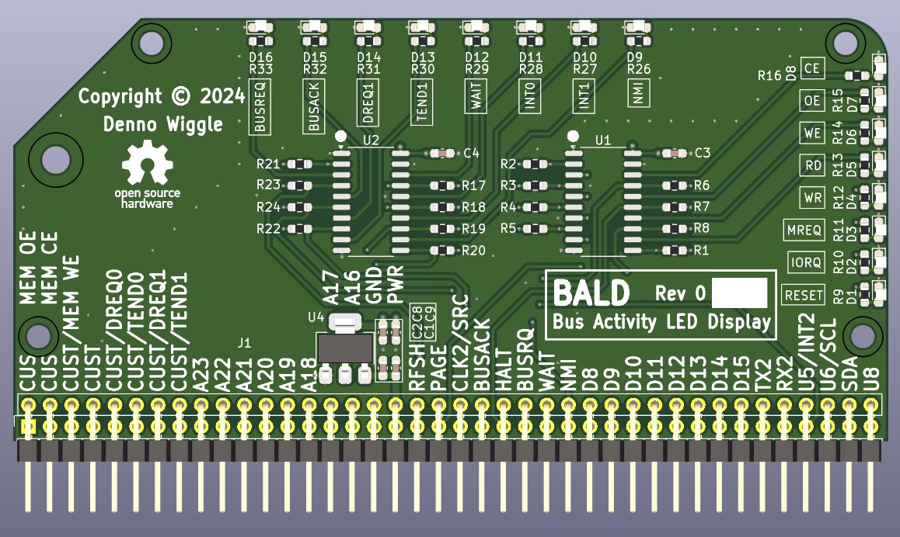
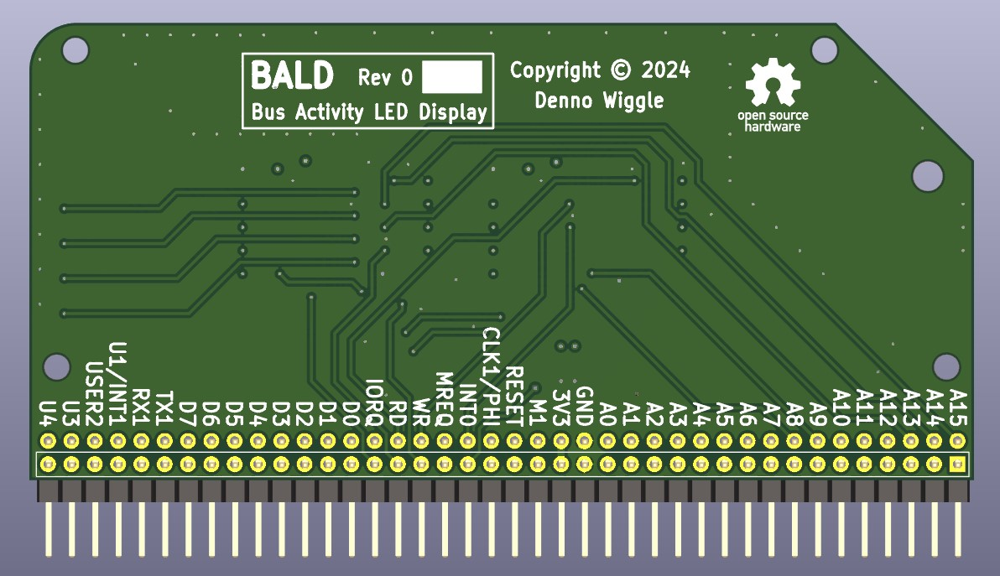

# BALD
Bus Activity LED Display.

## Description
BALD is an RCBUS board with LED's to show bus activity.

## Top View

## Bottom View

## BALD Board Rev 0.0 Release Notes

1. The 'output' directory contains the BOM, netlist, and PDF schematic.

2. Board design used KiCad 8.0.4.

