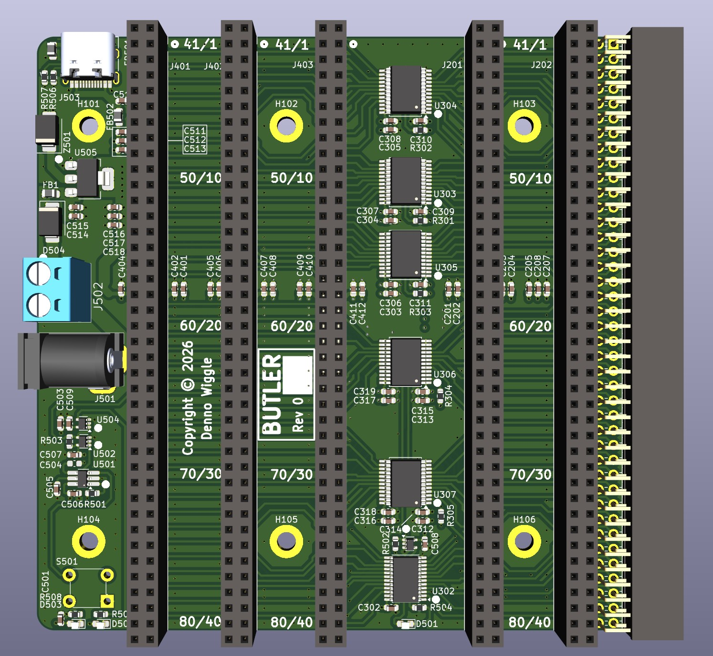
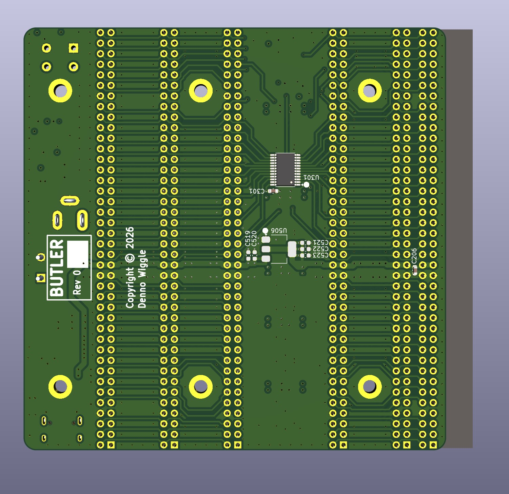

# BUTLER
Backplane with Universal Translation Logic for Exploring Retro

## Description
BUTLER is an RCBUS backplane board with voltage translation logic. It has 2 connectors for 3.3V cards and 3 connectors for 5V cards.

The buffer direction control signal comes from the [PETER](../PETER) FPGA. The card uses three backplane signals for GND as well as GND planes to try and improve signal integrity.

## Top View

## Bottom View

## BUTLER Board Rev 0.0 Release Notes
1. The [output](output/) directory contains the BOM, netlist, and PDF schematic.

2. Board design used KiCad 9.0
  

## BUTLER Future Changes.
1. Replace U505 5V LDO with TRACO POWER TSR 1-2450 or equivalent that has a wide input voltage operating range and is a switch mode power supply. This has been tested on the prototype as rework and worked well.

## Notes
Only preliminary testing has taken place.
   
