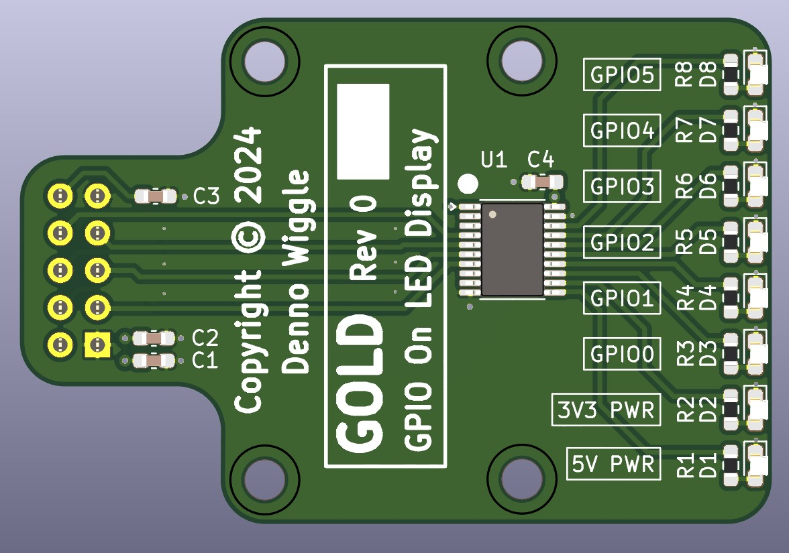
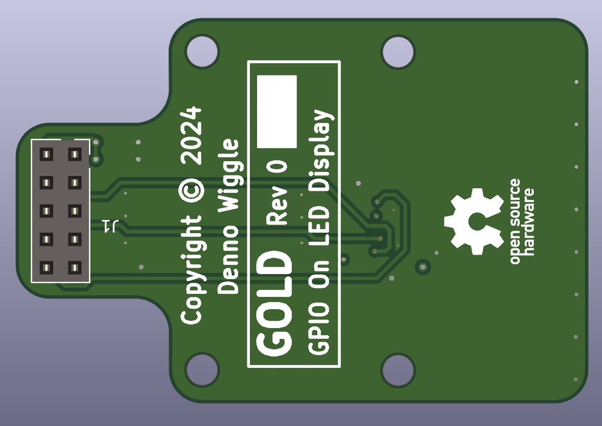

# GOLD
GPIO On LED Display

## Description
GOLD is a small breakout board that connects to the GPIO connector on PETER to display signal status on 6 LED's.

## Top View

## Bottom View

## GOLD Board Rev 0.0 Release Notes

1. The 'output' directory contains the BOM, netlist, and PDF schematic.

2. Board design used KiCad 8.0.4.

