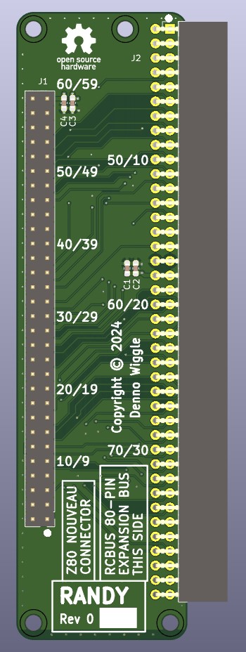
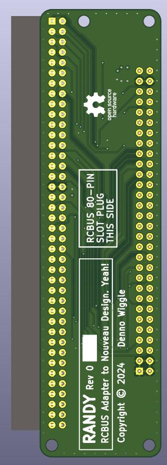

# RANDY
RCBUS Adapter to Nouveau Design. Yeah!

## Description
This project is an adapter board to interface the [2067-Z8S180 board](https://github.com/johnwinans/2067-Z8S180) from John Winan's Z80 Nouveau Project to an RCBUS backplane board connector.

## Top View

## Bottom View

## RANDY Board Rev 0.0 Release Notes

1. The 'output' directory contains the BOM, netlist, and PDF schematic.

2. Board design used KiCad 8.0.4.

3. J2 changed to Samtec SSW-140-02-F-D-RA.