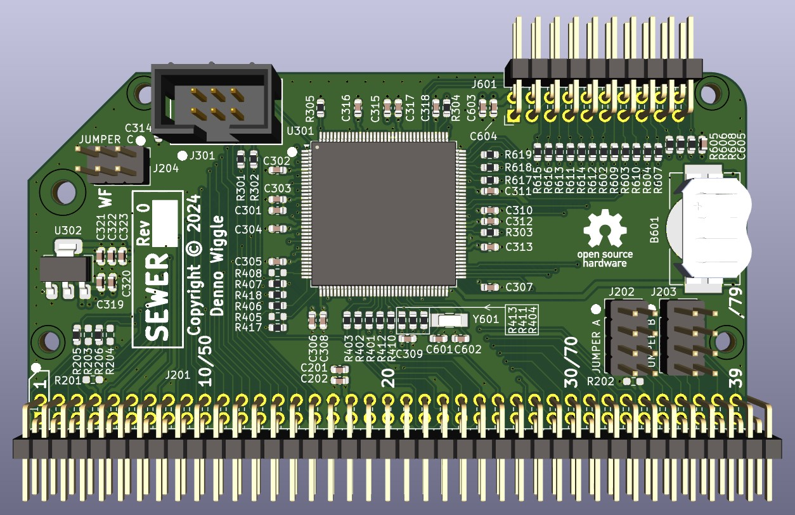
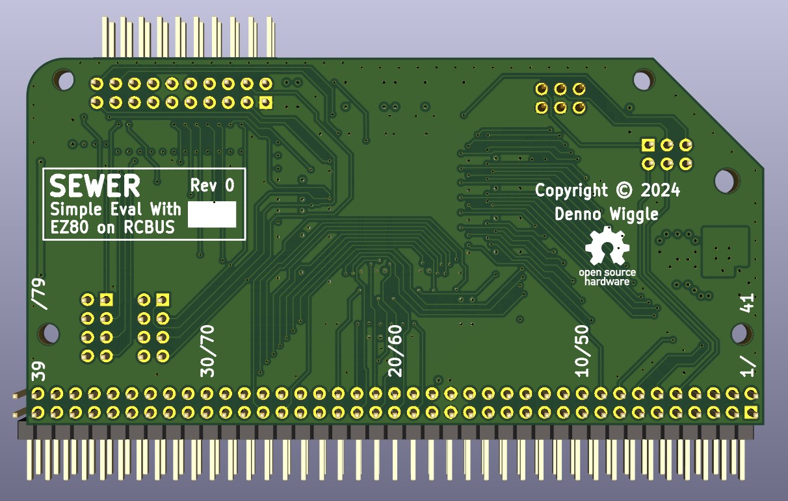

# SEWER
Simple Eval With EZ80F91 on RCBUS

## Description
SEWER is an RCBUS board with an ez80F91 CPU. There is no RAM or ROM memory hosted on the board.

## Top View

## Bottom View

## SEWER Board Rev 0.0 Release Notes

1. The 'output' directory contains the BOM, netlist, and PDF schematic.

2. Board design used KiCad 8.0.4.

3. This board was designed for evaluation purposes. It is not a final design.
