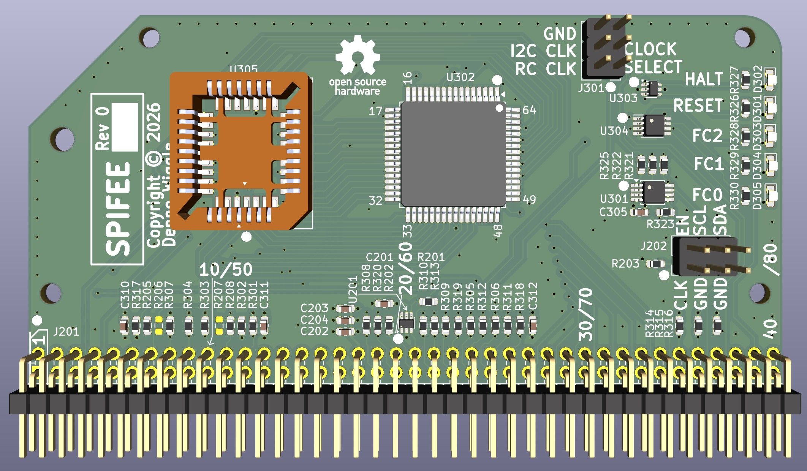
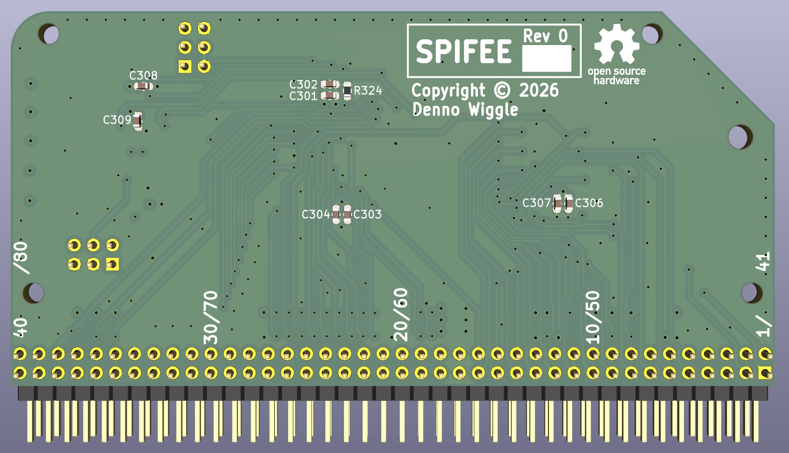

# SPIFEE
Sixty-eight thousand Processor Including Flash Engineering Eval

## Description
SPIFEE is an RCBUS board with an M68SEC000FU20 CPU that runs in 8-bit mode. There is no RAM or control signal decoding hosted on the board, that is taken care of on the main [PETER board](../PETER/).

The purpose of the card is to use it to learn 68000 programming.

## Top View

## Bottom View

## SPIFEE Board Rev 0.0 Release Notes
1. The ['output'](output/) directory contains the BOM, netlist, and PDF schematic.

2. Board design used KiCad 10.0

3. Jumper CPU_RESET_N to CPU_HALT_N, RCBUS pin 20 to pin 63.
   * If signals need to be separate then jumper CPU_HALT_N to spare pin on PETER FPGA e.g. spare GPIO pin on PETER GPIO header.
   
4. If using a socket for the FLASH have the assembly house solder the socket, or use a hotplate and hot air.
   * If soldering the FLASH part directly it is possible to program a blank FLASH when soldered onto the board from a ROM image inside the FPGA to start. First need to develop the ROM image to do that.
   
   
## Notes
The FLASH has not been tested yet.
   
