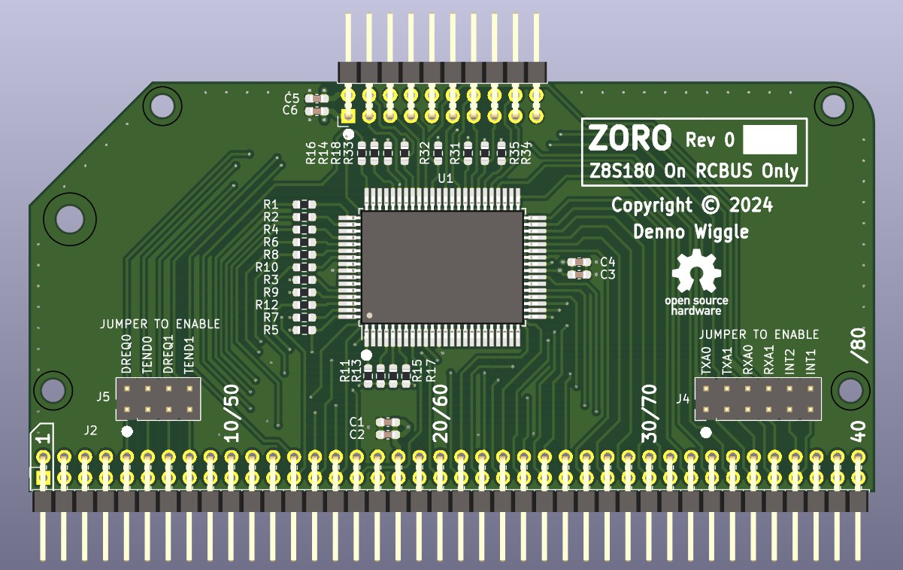
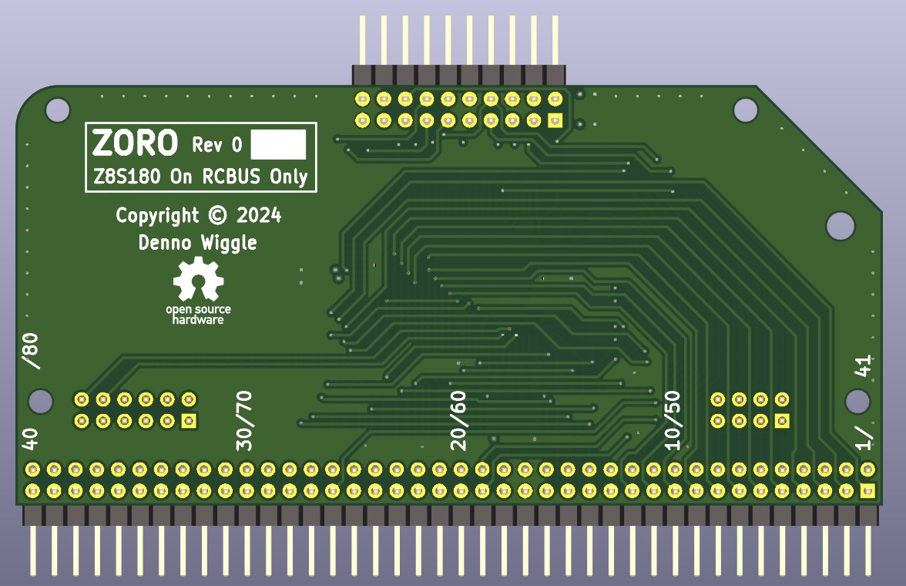

# ZORO
Z8S180 On RCBUS Only.

## Description
ZORO is an RCBUS board with a Z180 CPU. There is no RAM or ROM memory hosted on the board.

## Top View

## Bottom View

## ZORO Board Rev 0.0 Release Notes

1. The 'output' directory contains the BOM, netlist, and PDF schematic.

2. Board design used KiCad 8.0.4.

3. Change J2 to Adam Tech part number PH2RA-80-UA to reduce insertion force.